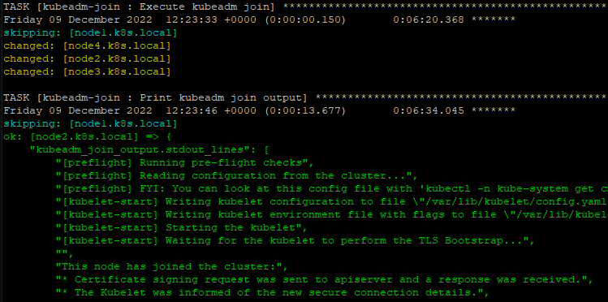

# fcos-k8s

<https://github.com/pvamos/fcos-k8s>

## Install Kubernetes v1.25.4 on Fedora CoreOS 37 with ignition, ansible and kubeadm

***A simple solution to install a Kubernetes test / development cluster in a fully automated way, in minutes.  
The cluster has one controlplane node and any number of worker nodes.***



## Requirements

- A controlplane node
  - x86_64, minimum 2GB RAM, 8GB storage, 1 CPU core *(ideally more)*
- Any (1+) number of worker nodes *(3 workers are in the included example)*
  - x86_64, minimum 4GB RAM, 20GB storage, 2 CPU cores *(ideally much more)*
- IPv4 networking for the nodes, with internet access *(using DHCP in the example)*
- DNS resolution of all node FQDN-s on all nodes *(using `/etc/hosts` file in the example)*
- Public internet connection on the nodes to access repos and packages
- SSH access of the nodes from the ansible host with key based authentication
- An ansible host with a fairly recent version of ansible. Tested with ansible core 2.12.10 and python 3.10.8.

## Installation

### Software versions used:
- Fedora CoreOS 37.20221106.3.0
  - Fedora CoreOS is an automatically-updating, minimal operating system for running containerized workloads securely and at scale. <https://getfedora.org/en/coreos>
- Linux kernel 6.0.7-301.fc37.x86_64
- Cri-o 1.25.1
  - CRI-O is an OCI-based implementation of the Kubernetes Container Runtime Interface. <https://cri-o.io>
- Kubernetes v1.25.4
  - Kubernetes, also known as K8s, is an open-source system for automating deployment, scaling, and management of containerized applications. <https://kubernetes.io/>
- Flannel v0.20.2
  - Flannel is a simple and easy way to configure a layer 3 network fabric designed for Kubernetes. <https://github.com/flannel-io/flannel>

### What is included:
- Example Fedora CoreOS `.fcc` ignition config and ignition files (in the `ignititon` directory)
- Ansible roles and playbook to configure Fedora CoreOS and install Kubernetes (in the `ansible` directory)
- Full output of a successful deployment run in `lastrun.log`

### Preparing the nodes

#### Actualize the CoreOS ignition configuration `.fcc` files

Modify the example configuration in `ignition` directory according to each available node.

- Add the ssh key that you will use to connect from the ansible host.
- Set the hostname in `/etc/hostname`.
- Check DNS resolution of all node FQDN-s on all nodes.
  - If you use a public or private domain with a DNS server you manage, set the relevant DNS records for the node.
  - Or use the `/etc/hosts` file on the nodes, like in the example.

<details><summary>See `node1.fcc` example</summary>
<p>

```yaml
variant: fcos
version: 1.4.0
passwd:
  users:
    - name: core
      groups:
        - docker
        - wheel
        - sudo
      ssh_authorized_keys:
        - ssh-ed25519 AAAAC3NzaC1lZDI1NTE5AAAAINHKcyMU729C1TDw+o+Ubh2Fz9VO11Ir6cOnVd30mKlG p@fedora
storage:
  files:
    - path: /etc/hostname
      overwrite: true
      contents:
        inline: node1.k8s.local
    - path: /etc/hosts
      overwrite: true
      contents:
        inline: |
          127.0.0.1       localhost             localhost.localdomain localhost4 localhost4.localdomain4
          ::1             localhost             localhost.localdomain localhost6 localhost6.localdomain6
          192.168.1.201   node1.k8s.local       node1
          192.168.1.202   node2.k8s.local       node2
          192.168.1.203   node3.k8s.local       node3
          192.168.1.204   node4.k8s.local       node4
          192.168.1.210   ansible.peter.local   ansible
          192.168.1.22    amd.peter.local       amd
          192.168.1.222   truenas.peter.local   truenas
    - path: /etc/sysctl.d/10-disable-ipv6.conf
      contents:
        inline: |
          # disable IPv6
          net.ipv6.conf.all.disable_ipv6 = 1
          net.ipv6.conf.default.disable_ipv6 = 1
          net.ipv6.conf.enp0s4.disable_ipv6 = 1
    - path: /etc/sysctl.d/99-kubernetes-cri.conf
      contents:
        inline: |
          # Kernel parameters required by the cri-o container engine.
          net.bridge.bridge-nf-call-iptables  = 1
          net.ipv4.ip_forward                 = 1
          #net.bridge.bridge-nf-call-ip6tables = 1
    - path: /etc/modules-load.d/crio-net.conf
      contents:
        inline: |
          # Kernel modules required by the cri-o container engine.
          overlay
          br_netfilter
systemd:
  units:
    - name: python3-for-ansible.service
      enabled: true
      contents: |
          [Unit]
          Requires=network-online.target
          After=network-online.target
          Before=sshd.service
          [Service]
          Type=oneshot
          ExecCondition=/usr/bin/test ! -f /etc/python3-for-ansible.done
          ExecStart=/usr/bin/sed -i '/\\[updates\\]/,/^\\[/ s/^enabled=.*$/enabled=0/' /etc/yum.repos.d/fedora-updates.repo
          ExecStart=/usr/bin/rpm-ostree install python3 libselinux-python3
          ExecStart=/usr/bin/sed -i '/\\[updates\\]/,/^\\[/ s/^enabled=.*$/enabled=1/' /etc/yum.repos.d/fedora-updates.repo
          ExecStart=/usr/bin/sed -i '/^\\[updates\\]/a exclude=libxcrypt-compat* mpdecimal* python-pip-wheel* python-setuptools-wheel* python-unversioned-command* python3* python3-libs* python3-selinux*' /etc/yum.repos.d/fedora-updates.repo
          ExecStartPost=/usr/bin/touch /etc/python3-for-ansible.done
          ExecStartPost=/usr/sbin/shutdown -r now
          [Install]
          WantedBy=multi-user.target
```

</p>
</details>

<https://github.com/pvamos/fcos-k8s/blob/main/ignition/node1.fcc>

### Generate ignition `.ign` files from `.fcc`

After modifying what's necessary in the `*.fcc` configs, `*.ign` files can be generated with `butane`.

```sh
butane --pretty --strict ignition/node1.fcc > node1.ign
```

<https://docs.fedoraproject.org/en-US/fedora-coreos/producing-ign/>

### Install Fedora CoreOS on nodes and apply the ignition config

To install Fedora CoreOS on nodes,
- boot from the Fedora CoreOS ISO (like the `fedora-coreos-37.20221106.3.0-live.x86_64.iso` used in the example) and manually apply the ignition config,
  - either using the `.ign` file locally with `coreos-installer install /dev/XXX --ignition-file=/path/file.ign`,
  - or fetching it with HTTP(S) `coreos-installer install /dev/XXX --ignition-url=https://host.domain.tld/path/file.ign`.
- Alternatively, create customized ISO or PXE images including the ignition configuration, and perform unattended installation.

<https://docs.fedoraproject.org/en-US/fedora-coreos/bare-metal/>

After completion (re)boot from the installed system.

#### A custom service to deploy Python 3

Note that the nodes will have an additional reboot:
We use a one time run only service to deploy python 3 at ignition to the nodes before ansible:

```sh
[Unit]
Requires=network-online.target
After=network-online.target
Before=sshd.service
[Service]
Type=oneshot
ExecCondition=/usr/bin/test ! -f /etc/python3-for-ansible.done
ExecStart=/usr/bin/sed -i '/\\[updates\\]/,/^\\[/ s/^enabled=.*$/enabled=0/' /etc/yum.repos.d/fedora-updates.repo
ExecStart=/usr/bin/rpm-ostree install python3 libselinux-python3
ExecStart=/usr/bin/sed -i '/\\[updates\\]/,/^\\[/ s/^enabled=.*$/enabled=1/' /etc/yum.repos.d/fedora-updates.repo
ExecStart=/usr/bin/sed -i '/^\\[updates\\]/a exclude=libxcrypt-compat* mpdecimal* python-pip-wheel* python-setuptools-wheel* python-unversioned-command* python3* python3-libs* python3-selinux*' /etc/yum.repos.d/fedora-updates.repo
ExecStartPost=/usr/bin/touch /etc/python3-for-ansible.done
ExecStartPost=/usr/sbin/shutdown -r now
[Install]
WantedBy=multi-user.target
```

We remove this temporary service with ansible later.

### Use ansible to deploy Kubernetes

#### Configure the nodes in `ansible/hosts` file

```
[controlplane]
node1.k8s.local

[workers]
node2.k8s.local
node3.k8s.local
node4.k8s.local
```

#### Set versions to use in `ansible/group_vars/all` file

```yaml
---
# The variables file used by the playbooks on all hosts.
# These don't have to be explicitly imported by vars_files: they are autopopulated.

gather_facts: true

k8s_version: 1.25.4
crictl_version: v1.25.0
crio_version: 1.25.1
crio_repo_version: 1.25
```

#### Run the main ansible playbook `fcos-k8s.yaml`

This ansible playbook deploys and configures the Kubernetes cluster to the Fedora CoreOS nodes.

```sh
time ansible-playbook -i hosts fcos-k8s.yaml
```

The `fcos-k8s.yaml` playbook applies the below roles to the cluster nodes:

```yaml
---

- name: Fedora CoreOS Kubernetes setup with kubeadm
  hosts: controlplane:workers
  roles:
    - remove-python3-for-ansible-service
    - fcos-k8s-base
      # kubeadm init on controlplane
    - role: kubeadm-init
      when: inventory_hostname in groups.controlplane
      # flannel depoy on controlplane
    - role: flannel-deploy
      when: inventory_hostname in groups.controlplane
      # kubeadm join on workers (test on controlplane)
    - role: kubeadm-join
    - role: coredns-pods
      when: inventory_hostname in groups.controlplane
```

### Start using your cluster

#### Connect to the Kubernetes cluster

Use the kube config placed at `~/.kube/config` on ansible node, also present at `/etc/kubernetes/admin.conf` on the controlplane node.

```
[p@ansible ansible]$ k get no -owide
NAME              STATUS   ROLES           AGE     VERSION   INTERNAL-IP     EXTERNAL-IP   OS-IMAGE                        KERNEL-VERSION          CONTAINER-RUNTIME
node1.k8s.local   Ready    control-plane   8m53s   v1.25.4   192.168.1.201   <none>        Fedora CoreOS 37.20221106.3.0   6.0.7-301.fc37.x86_64   cri-o://1.25.1
node2.k8s.local   Ready    <none>          7m5s    v1.25.4   192.168.1.202   <none>        Fedora CoreOS 37.20221106.3.0   6.0.7-301.fc37.x86_64   cri-o://1.25.1
node3.k8s.local   Ready    <none>          7m5s    v1.25.4   192.168.1.203   <none>        Fedora CoreOS 37.20221106.3.0   6.0.7-301.fc37.x86_64   cri-o://1.25.1
node4.k8s.local   Ready    <none>          7m5s    v1.25.4   192.168.1.204   <none>        Fedora CoreOS 37.20221106.3.0   6.0.7-301.fc37.x86_64   cri-o://1.25.1
[p@ansible ansible]$ k get po -A -owide
NAMESPACE      NAME                                      READY   STATUS    RESTARTS   AGE     IP              NODE              NOMINATED NODE   READINESS GATES
kube-flannel   kube-flannel-ds-jq27g                     1/1     Running   0          7m16s   192.168.1.202   node2.k8s.local   <none>           <none>
kube-flannel   kube-flannel-ds-krb2g                     1/1     Running   0          7m16s   192.168.1.204   node4.k8s.local   <none>           <none>
kube-flannel   kube-flannel-ds-msjrc                     1/1     Running   1          7m49s   192.168.1.201   node1.k8s.local   <none>           <none>
kube-flannel   kube-flannel-ds-xdgvq                     1/1     Running   0          7m16s   192.168.1.203   node3.k8s.local   <none>           <none>
kube-system    coredns-565d847f94-d7j89                  1/1     Running   0          6m14s   10.244.2.2      node4.k8s.local   <none>           <none>
kube-system    coredns-565d847f94-tcv92                  1/1     Running   0          6m14s   10.244.1.2      node3.k8s.local   <none>           <none>
kube-system    etcd-node1.k8s.local                      1/1     Running   2          9m1s    192.168.1.201   node1.k8s.local   <none>           <none>
kube-system    kube-apiserver-node1.k8s.local            1/1     Running   2          9m3s    192.168.1.201   node1.k8s.local   <none>           <none>
kube-system    kube-controller-manager-node1.k8s.local   1/1     Running   2          9m1s    192.168.1.201   node1.k8s.local   <none>           <none>
kube-system    kube-proxy-2r8g5                          1/1     Running   0          7m16s   192.168.1.202   node2.k8s.local   <none>           <none>
kube-system    kube-proxy-67mgb                          1/1     Running   1          7m49s   192.168.1.201   node1.k8s.local   <none>           <none>
kube-system    kube-proxy-7dqjz                          1/1     Running   0          7m16s   192.168.1.203   node3.k8s.local   <none>           <none>
kube-system    kube-proxy-tdx4x                          1/1     Running   0          7m16s   192.168.1.204   node4.k8s.local   <none>           <none>
kube-system    kube-scheduler-node1.k8s.local            1/1     Running   2          9m3s    192.168.1.201   node1.k8s.local   <none>           <none>
```

---

created by Péter Vámos pvamos@gmail.com <https://www.linkedin.com/in/pvamos/>

---

MIT License

Copyright (c) 2022 Péter Vámos

Permission is hereby granted, free of charge, to any person obtaining a copy
of this software and associated documentation files (the "Software"), to deal
in the Software without restriction, including without limitation the rights
to use, copy, modify, merge, publish, distribute, sublicense, and/or sell
copies of the Software, and to permit persons to whom the Software is
furnished to do so, subject to the following conditions:

The above copyright notice and this permission notice shall be included in all
copies or substantial portions of the Software.

THE SOFTWARE IS PROVIDED "AS IS", WITHOUT WARRANTY OF ANY KIND, EXPRESS OR
IMPLIED, INCLUDING BUT NOT LIMITED TO THE WARRANTIES OF MERCHANTABILITY,
FITNESS FOR A PARTICULAR PURPOSE AND NONINFRINGEMENT. IN NO EVENT SHALL THE
AUTHORS OR COPYRIGHT HOLDERS BE LIABLE FOR ANY CLAIM, DAMAGES OR OTHER
LIABILITY, WHETHER IN AN ACTION OF CONTRACT, TORT OR OTHERWISE, ARISING FROM,
OUT OF OR IN CONNECTION WITH THE SOFTWARE OR THE USE OR OTHER DEALINGS IN THE
SOFTWARE.
